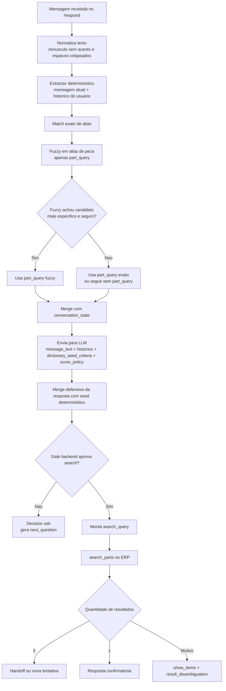

# Fluxo Runtime Do Pre-Search

## Objetivo

Este documento descreve o fluxo que transforma texto livre em:

- pergunta de follow-up
- pesquisa automatica no ERP
- handoff

O foco aqui e o detalhamento operacional do caminho atual, incluindo o fallback fuzzy de `part_query`.

O `README.md` raiz do projeto contem a versao resumida desse fluxo.

## Fluxo Geral

## Etapas

1. Normalizacao
   O extractor remove acento, baixa para minusculo e reduz espacos.

2. Extracao deterministica
   O catalogo carregado do Postgres tenta reconhecer:
   `part_query`, `part_code`, `vehicle_brand`, `vehicle_model`, `vehicle_year`, `engine`, `side`, `position`, `axle` e `quantity`.

3. Fuzzy fallback
   Hoje o fuzzy entra apenas para `part_query`.
   Ele compara janelas do texto com aliases curtos de peca.
   O match so entra no seed se:
   - o termo nao for curto demais
   - a distancia de edicao for pequena
   - a similaridade minima for atingida
   - houver diferenca segura para o segundo melhor candidato
   - ou, se ja existe match exato generico, o fuzzy encontrar um candidato mais especifico com seguranca suficiente

4. LLM como validador
   A LLM recebe `message_text`, historico, `dictionary_seed_criteria`, `conversation_state` e politica de score.
   Ela nao e o decisor final isolado.

5. Gate backend
   Depois da LLM, o backend recalcula:
   - campos obrigatorios por regra da peca
   - score minimo para liberar `search`
   - promocao ou rebaixamento entre `search` e `ask`

6. Busca no ERP
   So depois do gate o sistema monta a query textual e chama `search_parts`.

## Exemplos Reais

### Exemplo 1: pesquisa direta

Entrada:
`quero filtro de oleo do gol 2015`

Saida esperada:
- `part_query = filtro de oleo`
- `vehicle_model = Gol`
- `vehicle_year = 2015`
- decisao final: `search`

### Exemplo 2: typo recuperado por fuzzy

Entrada:
`preciso de cuxim da ecosport 2008`

Leitura do fluxo:
- `cuxim` nao bate exato
- o fuzzy avalia aliases de peca
- `coxim` vence com score alto
- o seed segue para a LLM com `part_query = coxim`
- o gate backend ainda decide se pode pesquisar

Saida esperada:
- `part_query = coxim`
- `vehicle_model = EcoSport`
- `vehicle_year = 2008`

### Exemplo 3: pergunta antes da busca

Entrada:
`radiador gol 2010`

Saida intermediaria:
- `part_query = radiador`
- `vehicle_model = Gol`
- `vehicle_year = 2010`
- falta `engine`

Decisao final:
- `ask`
- pergunta: `Qual a motorizacao do veiculo?`

## Regras Importantes

- o fuzzy nao consulta o texto grande do ERP
- o fuzzy nao libera `search` sozinho
- o fuzzy hoje e restrito a `part_query`
- o catalogo de aliases continua sendo a base principal
