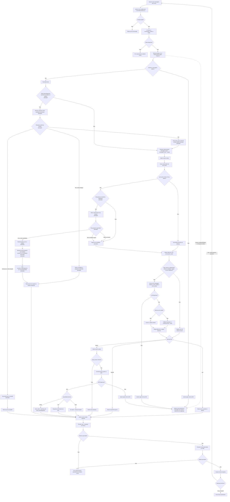
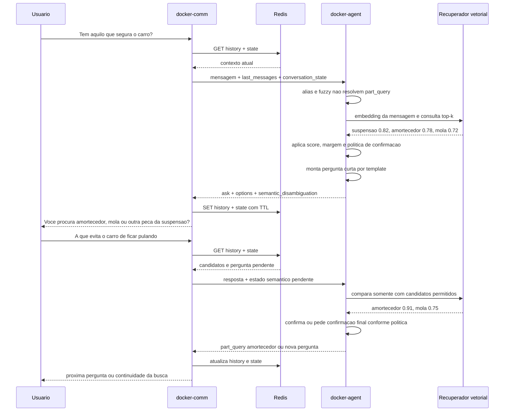

# Fluxo Runtime Do Pre-Search

## Objetivo

Este documento descreve o fluxo ponta a ponta que transforma texto livre em:

- pergunta de follow-up
- confirmacao semantica de familia de peca
- pesquisa automatica no ERP
- desambiguacao entre itens encontrados
- handoff
- resposta de erro operacional

O documento cobre o comportamento atual e mostra, de forma explicitamente marcada, onde a recuperacao semantica planejada na Prioridade 5 sera adicionada.

O `README.md` raiz do projeto contem a versao resumida do fluxo.

## Responsabilidades Dos Servicos

### `docker-comm`

- recebe a mensagem do canal
- normaliza `branch_id`
- le historico e estado da conversa no Redis
- envia `last_messages` e `conversation_state` ao `docker-agent`
- persiste a mensagem do usuario, a resposta e o estado retornado
- mantem somente a janela definida por `HISTORY_LIMIT`
- aplica o TTL definido por `SESSION_TTL_SECONDS`

Chaves existentes:

```text
conv:{conversation_id}:history
conv:{conversation_id}:state
```

### `docker-agent`

- normaliza e extrai criterios
- consulta catalogo deterministico
- valida contexto com LLM
- aplica regras e gate no backend
- monta pergunta, busca ou handoff
- consulta `soccol.item_search_candidates` quando a busca e liberada
- devolve o `ConversationState` atualizado ao `docker-comm`

### Postgres Do Catalogo

- e a fonte de verdade para familias, aliases, regras, veiculos, motores e politica de score
- na evolucao semantica, tambem sera a fonte dos documentos humanos vinculados a cada familia

### Redis

- continua sendo a unica persistencia de historico e estado multi-turno
- nao executa recuperacao semantica
- nao armazena o catalogo nem substitui o Postgres

### ERP

- recebe somente criterios ja validados pelo gate
- retorna zero, um ou varios itens candidatos
- continua usando filtros estruturados e ranking proprio

## Fluxo Ponta A Ponta

No diagrama abaixo, os blocos com a indicacao `planejado` pertencem a Prioridade 5 e ainda nao representam comportamento implementado.



## Ordem De Resolucao De `part_query`

A ordem planejada preserva as tecnicas atuais e adiciona embeddings apenas como fallback:

```text
1. alias exato
2. fuzzy matching
3. recuperacao semantica top-k
4. confirmacao do usuario
5. part_query canonica
6. regras e gate backend
7. busca ERP
```

Regras dessa ordem:

- alias exato continua prioritario
- fuzzy continua tratando typo e variacao lexical curta
- embedding trata descricao funcional, sintoma ou expressao popular
- candidato semantico nao vira `part_query` confirmado no mesmo turno
- o backend redige a pergunta por template usando somente candidatos aprovados
- a LLM fica opcional para redacao futura, condicionada a ganho comprovado
- apenas o backend interpreta score, margem e limite de tentativas

## Fluxo Da Desambiguacao Semantica Planejada



## Estado Conversacional

### Estrutura atual

```json
{
  "criteria": {
    "part_query": "radiador",
    "vehicle_model": "Gol",
    "vehicle_year": 2010
  },
  "pending_slot": "engine",
  "pending_question": "Qual a motorizacao do veiculo?",
  "last_decision": "ask"
}
```

### Extensao planejada

O campo novo sera opcional para manter compatibilidade com respostas e sessoes antigas.

```json
{
  "criteria": {
    "vehicle_model": "Gol"
  },
  "pending_slot": "part_query",
  "pending_question": "Qual destas familias mais se aproxima do que voce procura?",
  "last_decision": "ask",
  "semantic_disambiguation": {
    "original_text": "aquilo que segura o carro",
    "attempt": 1,
    "embedding_model": "modelo-versionado",
    "embedding_version": "v1",
    "candidates": [
      {
        "part_type_id": 10,
        "canonical_name": "amortecedores suspensao",
        "score": 0.82
      },
      {
        "part_type_id": 11,
        "canonical_name": "molas",
        "score": 0.76
      }
    ]
  }
}
```

O `docker-agent` monta e devolve esse objeto. O `docker-comm` apenas valida o contrato e persiste o estado completo na chave Redis ja existente.

## Caminhos De Interacao

| Entrada ou estado | Caminho | Resposta ao usuario | Estado seguinte |
|---|---|---|---|
| Texto invalido recebido pelo `docker-comm` | validacao de entrada | erro `400` | estado anterior nao e substituido |
| Schema ou mensagem invalida em chamada direta ao agent | validacao do `/respond` | agent retorna `400`; via `docker-comm` vira erro do gateway | mensagem pode ser preservada pelo comm |
| Redis indisponivel antes da chamada | falha ao carregar sessao | erro operacional do `docker-comm` | agent nao e chamado |
| Redis falha depois da resposta do agent | falha ao salvar historico ou estado | erro operacional do `docker-comm` | persistencia pode ficar incompleta e exige nova tentativa |
| Falha ao chamar o agent | timeout, indisponibilidade ou resposta invalida | erro do gateway | mensagem do usuario e preservada no historico |
| LLM indisponivel | caso nao e elegivel ao bypass e o validador nao consegue consultar inferencia | erro `503` | fluxo pode ser tentado novamente |
| LLM retorna JSON invalido | fallback do conteudo bruto com seed | `ask`, `search` ou `handoff` defensivo | estado correspondente a decisao |
| Alias exato e pedido completo | extractor, catalogo, regras e score | bypass da LLM e segue para busca | criterios validados |
| Alias exato, mas pedido incompleto | extractor deterministico | segue para validacao por LLM e gate | criterios mesclados |
| Typo seguro encontrado | fuzzy de `part_query` | segue para validacao e gate | familia canonica no criterio |
| Descricao generica com candidatos | recuperacao semantica planejada | pergunta com opcoes | `semantic_disambiguation` pendente no Redis |
| Resposta confirma opcao | resolucao contra candidatos pendentes | proxima pergunta obrigatoria ou busca | `part_query` canonica; estado semantico limpo |
| Resposta continua ambigua | nova comparacao restrita | nova pergunta de confirmacao | tentativa incrementada |
| Usuario rejeita opcoes | limpa candidatos | pede nova descricao ou faz handoff | estado semantico limpo |
| Limite de tentativas atingido | politica backend | handoff | encerra fluxo automatico |
| Falta criterio obrigatorio | gate retorna `ask` | pergunta por peca, modelo, ano, motor, lado, posicao, eixo ou variante | `pending_slot` correspondente |
| Caso fora do catalogo ou escopo | decisao `handoff` | informa encaminhamento | `handoff.required = true` |
| Decisao `search` sem query utilizavel | protecao do use case | pede mais detalhes | criterios atuais preservados |
| ERP indisponivel | falha de `search_parts` | erro `503` | conversa pode ser retomada |
| Busca retorna zero itens | `no_match` | informa ausencia e oferece atendimento humano | handoff por `no_match` |
| Busca retorna um item | confirmacao | mostra item e pede confirmacao de encaixe | criterios preservados |
| Busca retorna varios itens | desambiguacao de resultado | `show_items` | `pending_slot = result_disambiguation` |

## Etapas Do Caminho Atual

1. Normalizacao
   O extractor remove acento, baixa para minusculo e reduz espacos.

2. Extracao deterministica
   O catalogo carregado do Postgres tenta reconhecer:
   `part_query`, `part_code`, `vehicle_brand`, `vehicle_model`, `vehicle_year`, `engine`, `side`, `position`, `axle` e `quantity`.

3. Fuzzy fallback
   Hoje o fuzzy entra apenas para `part_query`.
   Ele compara janelas do texto com aliases curtos de peca.
   O match so entra no seed se:
   - o termo nao for curto demais
   - a distancia de edicao for pequena
   - a similaridade minima for atingida
   - houver diferenca segura para o segundo melhor candidato
   - ou, se ja existe match exato generico, o fuzzy encontrar um candidato mais especifico com seguranca suficiente

4. Merge de estado
   Os criterios da mensagem atual sao combinados defensivamente com o `ConversationState` recuperado do Redis pelo `docker-comm`.

5. Gate de bypass deterministico
   O backend libera diretamente apenas `search` quando existe alias exato ou `part_code` literal, todos os requisitos da familia estao preenchidos e o score minimo foi atingido.
   Um follow-up tambem pode usar esse caminho quando responde de forma deterministica ao `pending_slot` de um estado anterior com decisao `ask`.
   Fuzzy-only, familia generica, campo faltante, motor textual e estado incerto seguem para a LLM.

6. LLM como validador
   A LLM recebe `message_text`, historico, `dictionary_seed_criteria`, `conversation_state` e politica de score.
   Ela nao e o decisor final isolado.

7. Gate backend
   Depois da LLM, o backend recalcula:
   - campos obrigatorios por regra da peca
   - score minimo para liberar `search`
   - promocao ou rebaixamento entre `search` e `ask`

8. Busca no ERP
   So depois do gate o sistema monta a query textual e chama `search_parts`.

9. Telemetria por etapa
   O contrato retorna `tool_trace.pre_search_path` com `deterministic_bypass` ou `llm` e `tool_trace.stage_latency_ms` separado em `pre_search_validator`, `search_parts` quando executado e `response_assembly`.

10. Persistencia da resposta
   O `docker-comm` salva a janela de mensagens e o estado retornado pelo agent no Redis.

## Exemplos

### Pesquisa direta

Entrada:
`quero filtro de oleo do gol 2015`

Saida esperada:

- `part_query = filtro de oleo`
- `vehicle_model = Gol`
- `vehicle_year = 2015`
- decisao final conforme regras obrigatorias e gate

### Typo recuperado por fuzzy

Entrada:
`preciso de cuxim da ecosport 2008`

Leitura do fluxo:

- `cuxim` nao bate exato
- o fuzzy avalia aliases de peca
- `coxim` vence com score alto
- o seed segue para a LLM com `part_query = coxim`
- o gate backend ainda decide se pode pesquisar

### Pergunta por criterio obrigatorio

Entrada:
`radiador gol 2010`

Saida intermediaria:

- `part_query = radiador`
- `vehicle_model = Gol`
- `vehicle_year = 2010`
- falta `engine`
- decisao `ask`
- pergunta `Qual a motorizacao do veiculo?`

### Descricao generica com recuperacao semantica planejada

Entrada:
`quero aquilo que evita o carro de ficar pulando`

Leitura planejada:

- alias e fuzzy nao confirmam uma familia
- embeddings recuperam candidatos reais como amortecedor e mola
- backend aprova apenas os candidatos que passaram pela politica
- backend redige uma pergunta por template usando essas opcoes
- `docker-comm` persiste a desambiguacao pendente no Redis
- somente a resposta seguinte pode consolidar `part_query`

## Regras Importantes

- o Redis existente e a unica persistencia de estado conversacional
- o fuzzy nao consulta o texto grande do ERP
- o fuzzy nao libera `search` sozinho
- o fuzzy hoje e restrito a `part_query`
- o bypass deterministico so libera `search` e pode ser desligado por feature flag
- casos que nao comprovam completude continuam no caminho LLM
- `part_code` so e aceito com evidencia literal em mensagem do usuario ou validacao do extractor
- `part_code` nao e restaurado apenas porque existe em `conversation_state`
- a recuperacao semantica sera fallback, nao substituicao do extractor
- similaridade vetorial nao valida aplicacao veicular
- candidato semantico exige confirmacao na primeira versao
- falha semantica deve seguir pelo fluxo atual
- a LLM nao pode criar familia fora dos candidatos aprovados
- o catalogo de aliases e regras continua sendo a base principal
- o backend continua sendo a autoridade final para `ask`, `search` e `handoff`
